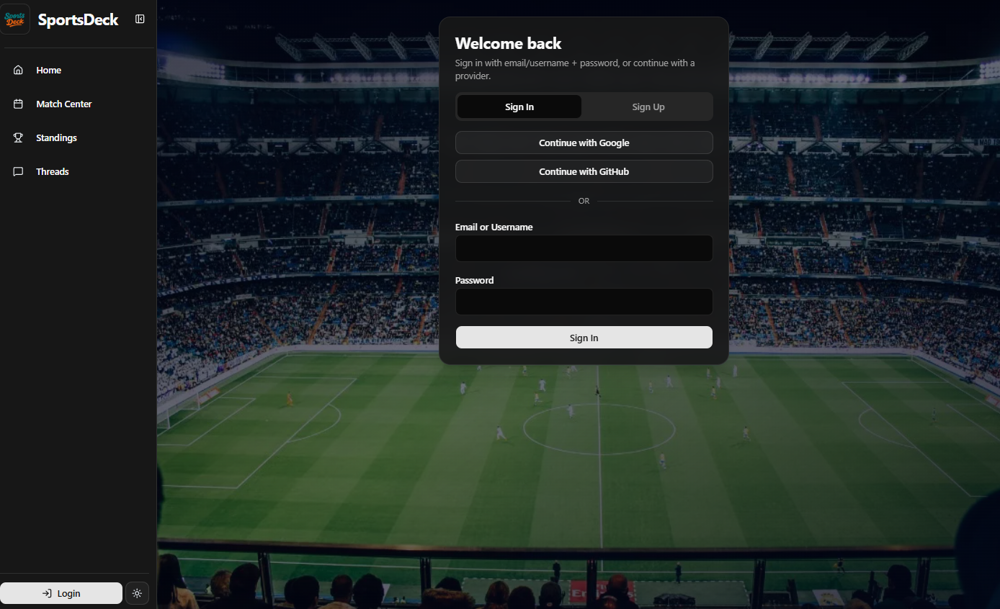
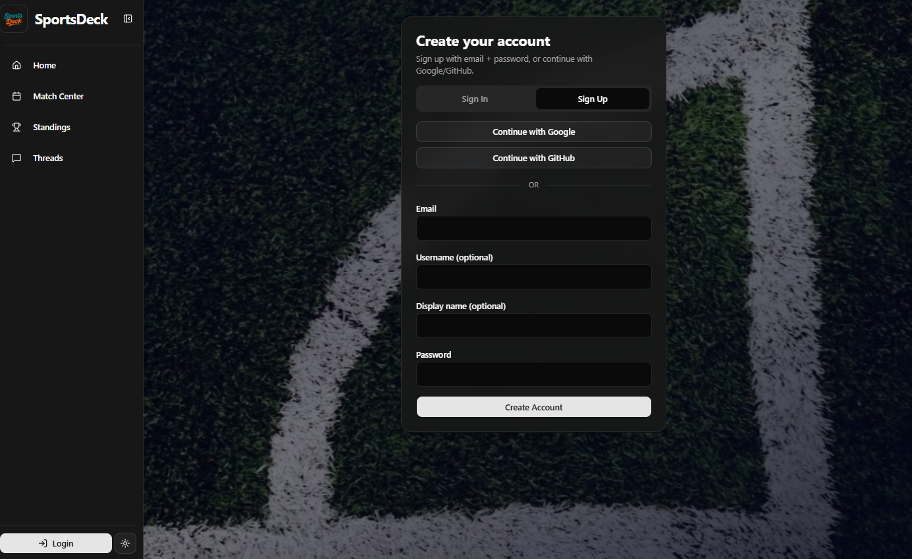
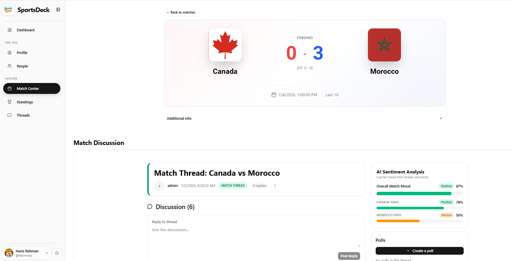
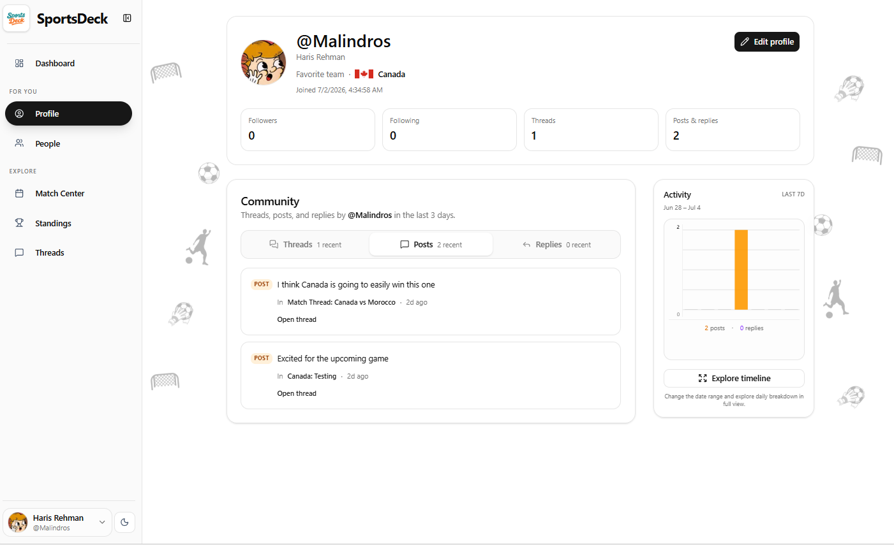
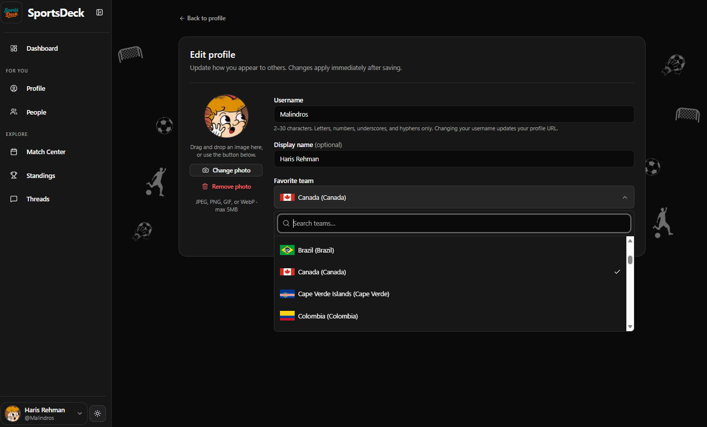

# WorldCupStop / SportsDeck

SportsDeck is a football (soccer) community platform built with Next.js. It combines live competition data — matches, standings, teams, seasons — with a social layer: user profiles, follows, a personalized activity feed, and per-match/per-team discussion forums, backed by lightweight AI features for moderation, sentiment, and translation.

## Features

- **Accounts & auth** — email/password signup plus Google and GitHub OAuth, JWT-based sessions (short-lived access token + refresh token).
- **Profiles** — public profile pages with avatar, favorite team, followers/following counts, and activity history; profile editing with avatar cropping.
- **Social graph** — follow/unfollow, sortable followers/following lists, remove-follower support.
- **Personalized dashboard feed** — recent posts/replies from people you follow, updates for your favorite team, grouped so it doesn't overwhelm.
- **Forums** — threads scoped to a match, a team, or general discussion, with nested replies, tags, and polls.
- **Live football data** — competitions, teams, matches, and standings ingested from an external provider (football-data.org-compatible API) and kept fresh by a scheduled worker.
- **AI-assisted moderation** — automatic content moderation verdicts and toxicity scoring, a reports/appeals workflow, and an admin panel for bans and moderation actions.
- **Sentiment & digests** — per-thread sentiment summaries and a daily digest generated from recent activity.
- **Translation cache** — on-demand translation of non-English posts, cached to avoid repeat inference calls.
- **API** — REST endpoints under `src/app/api`, documented via an auto-generated OpenAPI spec and a Postman collection.

## Screenshots

| Sign in | Create account |
| --- | --- |
|  |  |

| Match detail & discussion | Profile & activity |
| --- | --- |
|  |  |

| Edit profile |
| --- |
|  |

## Tech stack

- **Framework:** Next.js 16 (App Router), React 19
- **Database:** PostgreSQL via Prisma ORM
- **Auth:** JWT (`jsonwebtoken`), `bcrypt` for password hashing, OAuth (Google/GitHub)
- **AI:** Hugging Face Inference API (moderation, sentiment, translation)
- **UI:** Tailwind CSS, Radix UI, shadcn, lucide-react
- **Ops:** Docker Compose (app + worker + Postgres + nginx)

## Repository layout

```
sports-deck/
├── src/app/            # Next.js routes (pages + REST API under app/api)
├── src/lib/            # Auth, JWT, OAuth, moderation, sentiment, inference helpers
├── prisma/             # Prisma schema, migrations, generated client & OpenAPI spec
├── scripts/            # Data-fetch scripts and the scheduled ingestion worker
├── docs/user-stories/   # Feature specs written as user stories
├── nginx/              # Reverse proxy configs (HTTP + HTTPS)
├── docker-compose.yaml # web / worker / db / nginx services
└── FETCHING.md         # Data ingestion env vars and script reference
```

## Getting started

All commands run from the `sports-deck/` directory.

### 1. Prerequisites

- Node.js 20+
- A PostgreSQL database (or use the provided `docker-compose.yaml`)
- An API token from a football-data provider (for `FD_TOKEN`) if you want live data
- A Hugging Face token (for `HF_TOKEN`) if you want moderation/sentiment/translation/digests

### 2. Install dependencies

```bash
cd sports-deck
npm install
```

### 3. Configure environment

Create a `.env` (or `.env.local`) file with at least:

| Variable | Required | Purpose |
| --- | --- | --- |
| `DATABASE_URL` | Yes | Postgres connection string |
| `JWT_SECRET` | Yes | Signs access tokens (`openssl rand -base64 32`) |
| `JWT_REFRESH_SECRET` | Yes | Signs refresh tokens |
| `FD_TOKEN` | For data fetch | Token for the football data provider |
| `HF_TOKEN` | For AI features | Hugging Face inference token |
| `GOOGLE_CLIENT_ID` / `GOOGLE_CLIENT_SECRET` / `GOOGLE_REDIRECT_URI` | For Google login | OAuth credentials |
| `GITHUB_CLIENT_ID` / `GITHUB_CLIENT_SECRET` / `GITHUB_REDIRECT_URI` | For GitHub login | OAuth credentials |
| `APP_BASE_URL` | For OAuth | Base URL used to build redirect URIs |

See [`FETCHING.md`](sports-deck/FETCHING.md) for the full list of data-ingestion variables (`COMPETITION`, `SEASON`, `CRON_SCHEDULE`, retry/rate-limit settings, etc.).

### 4. Set up the database

```bash
npx prisma migrate deploy   # or `prisma migrate dev` while developing
```

### 5. (Optional) Fetch live football data

```bash
npm run fetch:competitions
npm run fetch:teams
npm run fetch:matches
npm run fetch:standings
```

### 6. Run the app

```bash
npm run dev
```

Open [http://localhost:3000](http://localhost:3000).

To also run the hourly data-refresh worker alongside the dev server, use `./run.sh`, or start it separately with `npm run start-worker`.

## Docker

```bash
docker compose --profile local up --build
```

This brings up the Next.js app, the ingestion worker, Postgres, and an nginx reverse proxy. Use the `prod` profile for the HTTPS nginx config (expects certificates under `/etc/letsencrypt`).

## API documentation

- OpenAPI spec: `prisma/openapi/openapi.yaml` (regenerate with `npx prisma generate`)
- Postman collection: [`postman_collection.json`](sports-deck/postman_collection.json)

## Docs

Feature behavior is specified as user stories in [`docs/user-stories/`](sports-deck/docs/user-stories/), covering auth, profiles, follows, the dashboard feed, and activity charts.
